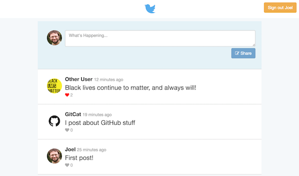

# Problem: Chirper (Firebase)

In this exercise, you will practice working with the [Firebase](https://firebase.google.com/) service: first for _user authentication_, then as a _realtime database_. You will be using this service to create a simple Twitter clone called "Chirper":



**Important** This problem involves creating one single application, but is broken up into two parts for clarity. Each problem has its own test suite (`.spec.js` file), but all of the instructions are included in this single README file.

**Double Important** And because there are two test suites, you will need to use the full file name when specifying which tests to run:

```bash
# Must be in the root directory of the problem set!
cd /path/to/problem-set

# for example
jest problem-part-1
```

**TRIPLE IMPORTANT!!** You'll need to run the tests from the **root directory** (not inside of the `problem-a` folder).

## Running the Program
Because this app is created with React (and scaffolded through [Create React App](https://github.com/facebook/create-react-app)), you will need to install dependencies and run a developer web server in order to transpile and view the application. You can run this server by using the command:

```bash
# go inside the `problem-a/` folder
cd path/to/problem-a

# install dependencies
npm install  # only once

# run the server
npm start
```

You can then view the rendered page _in a web browser_. Remember to check the Developer console for any errors!

## Part 1 Instructions
In this part, you will add functionality that allows the user to sign up for and log into the web app.

To complete the exercise, you will need to edit the included **`src/index.js`** and **`src/App.js`** files. Note that you should not need to edit any of the other provided files (yet!).
(As a demonstration of how a complete React application may be structured, the different components are each defined in separate files. While the `<App>` is defined in `App.js`, the `<SignUpForm>` it utilizes is defined in the `components/signup/SignUpForm.js` file).


1. The first thing you will need to do is create a new Firebase project and add its configuration to your web app. 

    1. Create a new project in the [Firebase Web Console](https://console.firebase.google.com/): click the "Add Project" button, and give it a unique name (try `chirper-your-uw-id`).

    2. Modify the **`src/index.js`** file to add in your project's configuration. You will need to `import` the code firebase library as well as the authentication module.

        ```js
        import firebase from 'firebase/app';
        import 'firebase/auth'; 
        ```

        Also **copy and paste** the configuration script from the Firebase webpage (The `// Initialize Firebase ...` part). Insert this code ___before___ the `ReactDOM.render()` call.

    3. Enable user authentication for your app in the Firebase Web Console (through the "Authentication" tab in the navigation menu). Click the "Set Up Sign-In Method" button, choose the "Email/Password" option and Enable it.

    This will finish your configuration in the Firebase Web Console, but you can keep the page open to view/debug your app as you sign up new users.

2. The `<SignUpForm>` component (that renders the actual form) is passed the App's **`handleSignUp()`** method as a callback function. Fill in this method (in the `App` component) so that when it is executed, it creates a new user in the Firebase database.

    1. Use the [`firebase.auth().createUserWithEmailAndPassword()`](https://firebase.google.com/docs/reference/js/firebase.auth.Auth#createUserWithEmailAndPassword) function to create a user with the given `email` and `password`. Note that you will need to `import firebase from 'firebase/app'` in this module as well in order to access the `firebase` global object.

    2. After the `createUser...` function finishes (e.g., `.then()`), you should [update the profile](https://firebase.google.com/docs/auth/web/manage-users#update_a_users_profile) of the created user. The credentials for that user will be passed as a parameter to the `.then()` callback. Update the profile so that the `displayName` is the passed in `handle`, and the `photoURL` is the passed in `avatar`.

        _Remember to return the promise returned by `updateProfile()` for chaining!_

        - _Optionally_, after the `updateProfile` function is called (e.g., `.then()`), you can modify the **`user`** who is stored in the state so that has appropriate values for its `displayName` and `photoURL` properties when first created.

    3. You should also `catch()` and display any errors with the sign-up process (any time the promises are rejected&mdash;either the `createUser...` promise or the `updateProfile` promise you return). In particular, the `catch()` callback should update the Component's `state` to make the **`errorMessage`** value be the `message` property of the callback's passed-in error (i.e., `error.message`). You can temporarily log out the passed in error for debugging. This will cause the error message to be displayed (see the `render()` function for details how!)

    Once this method is implemented, you should be able to fill out the form and sign up a user, who you will be able to see in the Firebase Web Console.

3. Next you will need to make the page be able to respond to a user logging in (which occurs automatically at sign-up) or logging out by handling _authentication events_.

    - Add a **`componentDidMount()`** lifecycle method to the `App` component, and have that method call `firebase.auth().onAuthStateChanged()` to register a listener for authorization events.

        If the callback's argument (a Firebase User object) is defined, you should assign that value to a **`user`** property in the Component's `state`. Otherwise, you should assign a value of `null` to the `user` property in Component's `state`.

        Remember to use `setState()` to update the state!

    - The `onAuthStateChanged()` method returns a _new function_ that can be used to "unregister" the listener. Save this function as an instance variable (e.g., `this.authUnRegFunc`).

    - Finally, add a **`componentWillUnmount()`** method so that when the component is being removed (the App is going away), you call this saved unregister function (it takes no arguments).
    
    Now when you sign up the user (or refresh the page), you should see an example welcome message! Note that this message is _conditionally rendered_ based on **`this.state.user`**, so be sure you have updated that state variable correctly!

4. Now that users can sign up, you should also make sure they can sign in and out again. Fill in the App's **`handleSignIn()`** and **`handleSignOut()`** methods to provide this functionality:

    - In `handleSignIn()`, you should call `firebase.auth().signInWithEmailAndPassword()`, passing in the given `email` and `password`. Again, you should `.catch()` any errors and assign their `message` to the **`errorMessage`** property of the state.

        Note that when the user signs in, this will cause an "authentication event" that will be caught by the listener you registered in the previous step, which then causes the `render()` function to show them as logged in!
    
    - In `handleSignOut()`, you should call `firebase.auth().signOut()`.

    Now you should be able to log your users in and out!

5. Finally, you may have noticed that when you refresh the page, it briefly shows the sign-up form before realizing that the user is logged in already and re-rendering to show the welcome message. Modify the app so that it instead shows a "spinner" while it is loading authentication information, then displays either the sign-in form or the welcome message as appropriate.

    - To do this, add a new variable **`loading`** to the App's `state`. Initialize this variable as `true` in the constructor.

    - Modify the App's `render()` function so that _if_ the `loading` state is `true`, then it just returns the following DOM content to show a Font-Awesome spinner (instead of returning anything else):

        ```html
        <div class="text-center">
            <i class="fa fa-spinner fa-spin fa-3x" aria-label="Connecting..."></i>
        </div>
        ```

    - Finally, modify your `onAuthStateChanged()` callback (in `componentDidMount()`) so that in addition to setting the `user` state variable, you also set the `loading` state variable to be `false`. In other words, the page will "stop" loading once an authentication event has been received (whether that is logging in or logging out).

    Now you should see a spinner instead of the sign up form when you refresh the page while signed in!


## Part 2 Instructions
In this part, you will add the ability for users to post messages ("chirps"), as well as see the messages posted by others. This will give you practice using the Firebase _realtime database_.

To complete the exercise, you will need to make minor changes to **`src/index.js`**, and **`src/App.js`**, and significant changes to the components in the **`src/components/chirper/`** folder. 
(Because this is a large app, the components are separated into separate modules (files) to keep things more manageable.)

1. In **`src/App.js`**, add `import` statements to import the `ChirperHeader`, `ChirpBox`, and `ChirpList` from their respective modules in the `./components/chirper/` directory. Note that all of these components are _default exports_, so you should import them using `import ComponentName from 'module'` syntax.

    Then modify the `App` component's `render()` function so that instead of showing a `<WelcomeHeader>` when the user is logged in, it shows a `<ChirperHeader>`. Note that these components expect and use the same props, so you can just change the tag from `<WelcomeHeader>` to `<ChirperHeader>`. This should show the application header instead of the testing welcome message when logged in.

    Additionally, when the user is logged in, the `App` should also render a `<ChirpBox>` component and a `<ChirpList>` component _after_ the `<ChirperHeader>` (as siblings). Each of these components should be passed the current signed in user (the value in `this.state.user`) as a **`currentUser`** prop, so that they know who is logged in. This should allow you to see the "post a chirp" form.

2. In order to access the realtime database, you will need to make a couple of configuration changes:

    1. In **`src/index.js`**, be sure to `import 'firebase/database'` to make that module available.

    2. In the Firebase Web Console, you will need to specify the [security rules](https://firebase.google.com/docs/database/security/) for the database. You should specify the following rule:

        ```json
        {
          "rules": {
		    ".read": true,
            "chirps": {
              ".write":"auth != null"
            }
          }
        }
        ```

        This specifies that _everyone_ can read the data (see the chirps), but only authenticated users will be able to edit the data.

3. Modify the **`ChirpBox`** component so that the user is able to post a new message to the network. You can do this by filling in the **`postChirp()`** method (which is executed when the "Share" button is pressed).

    First define an Object (e.g., `newChirp`) that will represent the new post. This Object should have the following properties:

    - **`text`** that is the value the user has entered into the textbox (saved as **`this.state.post`**)
    - **`userId`**, which should be the `uid` property of the given `currentUser` prop.
    - **`userName`**, which should be the `displayName` property of the `currentUser`
    - **`userPhoto`**, which should be the `photoURL` property of the `currentUser`
    - **`time`**, which should be a timestamp for when the post is recorded. You can use the constant **`firebase.database.ServerValue.TIMESTAMP`** to specify that the time should be whatever time the post is added to the Firebase server.

    Then use the `firebase.database().ref()` to get a reference to the `chirps` entry in the database, and use the `push()` method to add the new chirp to the database. You will need to `import` the `firebase` global from `firebase/app` here as well to make it available. 

    This should allow you to post new Chirps, which you will be able to see in the Firebase Web Console (though not in the app yet!)

4. Modify the **`ChirpList`** component so that it listens for changes to and downloads the list of chirps in the database.

    Add a **`componentDidMount()`** method, in which you get a reference to the `'chirps'` entry in the database. Save this reference as an instance variable (e.g., `this.chirpsRef`) for use later (so you don't need to look it up later).

    Then call the `.on()` method on this reference to register a listener for `'value'` events. The callback for this listener will be passed as a parameter a database `snapshot`; call the `.val()` method on this snapshot to turn it into a JavaScript object, and save that object in the component's state as a **`chirps`** property.

    Also implement the **`componentWillUnmount()`** method, and call the `.off()` function on the reference to "unregister" the listener when the component is removed. This will keep your app from crashing when the user logs out!

5. Fill in the **`ChirpList`** component's `render()` method so that it renders an array of `<ChirpItem>` elements based on the data stored in `this.state.chirps`. But because "lists" are stored as _Objects_ in Firebase and not as Arrays, there are a few steps to this:

    1. Use the `Object.keys()` function to get an array of keys (strings) from the `this.state.chirps` object.

        Then use the `.map()` function to transform each element in this array into an Object (a `{}`) representing the chirp. You can do this by having the _mapping_ callback return the value at that particular key:

        ```js
        chirpKeys.map((key) => {
            let chirpObj = this.state.chirps[key];
            return chirpObj;
        })
        ```

        In addition, give each "chirp object" a new **`id`** property whose value is that object's "key". This will allow you to check track of which chirp is which! 
    
    2. Optionally: use the JavaScript [`sort()`](https://developer.mozilla.org/en-US/docs/Web/JavaScript/Reference/Global_Objects/Array/sort) method to sort the array of chirp objects by their `time` property in descending order.

    3. Finally, _map_ the "chirp array" into an array of `<ChirpItem>` elements (as you've done in previous exercises). Each `<ChirpItem>` should be passed a **`chirp`** prop that is the chirp object (with its `id`!), as well as a **`currentUser`** prop that is the current user. Assign this to the **`chirpItems`** variable.

        - Don't forget to also assign the element a `key` attribute so that React can keep track of them. The chirp's `id` is a good value to use as the array `key`.      

    This should allow you to see the Chirps displayed when they are posted! Try posting more (and when logged in as different users) to see it in action.

6. Finally, add the ability for a user to "like" a chirp by clicking on the heart icon. You can add this functionality by filling in the **`likeChirp()`** method in the **`ChirpItem`** component (found at the bottom of the `src/components/chirper/ChirpList.js` file).

    You will do this by giving each "chirp" a new **`likes`** property, which itself is an object whose properties are **user uids** and whose values are `true` (indicating that user has liked the chirp). This structure means that each `chirp` object (including the one passed in as a prop to the `<ChirpItem>`) may have a `likes` property! If that property is `undefined`, then it just means that no one has liked the chirp yet.

    1. First, you'll need a reference to the specific chirp's `likes` property in the database (at `chirps/:id/likes`, where `:id` is the chirp id). Use the `firebase.database().ref()` function to get this reference, either by specifying a path to that element or by using the `child()` method.

    2. Next, define a variable that is an _updated_ version of the current `this.prop.chirp.likes` object. (If the `likes` property is undefined, then your updated version should start out as an empty object `{}`).

        Add a property to this object whose key is the _current user_'s `uid` and whose value is `true`, representing that the current user has "liked" the chirp. If the user has already liked the chirp (there is already a key for their `uid`), you should instead assign a value of `null` to that property&mdash;this will cause it to be removed from the Firebase database.

    3. Finally, call the `.set()` method on the specific chirp's reference to assign the updated value to that element in the Firebase database. Again, `catch()` if the Promise is rejected and log out any errors.
        
    This should add in "liking" functionality, so you can like the stuff you've done!

And that's it! With a dozen changes (and some scaffolding HTML), you've created a basic Twitter clone.
